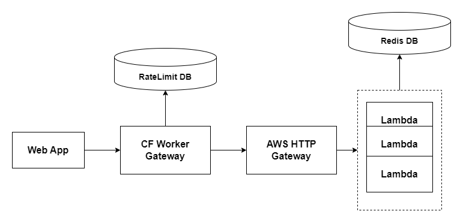

# Gapfind Serverless

A serverless version of the project [find-your-gap](https://github.com/dgop92/find-your-gap-api) that was originally written in Django. Check out the project to learn more about what it does.

## Motivation

After Heroku removed the free plan, it was necessary to look for a different provider to host this project and with the desire to bring back the project and learn something in the process, I decided to rewrite the app using AWS Lambda + HTTP Gateway.

## What I learn

- AWS Lambda
- AWS HTTP Gateway
- AWS SAM with CDK
- Manual rate limiting with Cloudflare Workers
- Navigate through old written code and rewrite it while keeping the same functionality

## System Diagram



- Lambda functions to write the code for the different endpoints of the application.
- Redis: Simple key-value database for saving the user schedules
- HTTP Gateway integration to call the lambda functions through HTTP.
- CF worker: AWS HTTP Gateway throttling configuration is not enough to avoid abuse of the lambda functions. WAF is expensive for this project. Workers provide me with DDOS Protection out of the box and allow me to configure requests per minute with only a couple of lines of code.
- RateLimit DB: a simple database to keep track of the requests per minute per IP.

## Setup

1. AWS Lambda + HTTP Gateway
   1.1 Go to gapfind_ias/env-vars and create the .env file for the desired environment (dev, prod, etc).
   1.2 Run the following commands to deploy the application to AWS:
   ```bash
    cdk synth <APP_NAME>-main-dev-stack -c config=dev
    cdk diff <APP_NAME>-main-dev-stack -c config=dev
    cdk deploy <APP_NAME>-main-dev-stack -c config=dev
   ```
   More on gapfind_ias/README.md
2. Redis
   2.1 Create a Redis instance using your preferred provider. I decided to use Aiven because they offer a free tier. Remember to set the url in AWS parameter store.
3. Clouflare Workers
   3.1 Configure the `.dev.vars` file and `[vars] section` in wrangler.toml
   3.2 For the RateLimit DB I'm using a flask app deployed in python anywhere but you can use any other service like the suggested one by Cloudflare, upstash.

## Lessons and notes

### Design

The previous design is overly complex for only a simple API with less than five endpoints. All of this because we are designing with free services and we don’t want to spend a single penny. A simpler solution is to deploy the API using the cheapest virtual machine with docker. The following are possible alternatives for this application:

- Two containers for FastAPI and Redis. A simple Python dictionary as the RateLimit DB inside the FastAPI application.
- Making minor changes in the Django application such as the Python dictionary for rate limit and changing the database from Postgres to SQLite 3.

### Experience

Serverless may help you to reduce cost and focus on business logic but there is a price to pay. In my case, the most remarkable drawback was the development experience. The development cycle is slower because you need to deploy the application to see the changes. The local development environment using SAM is not 100% similar as the production environment (ex: base64 encoding). If your lambda functions requires dependencies the building process to test it locally is a bit slow.
